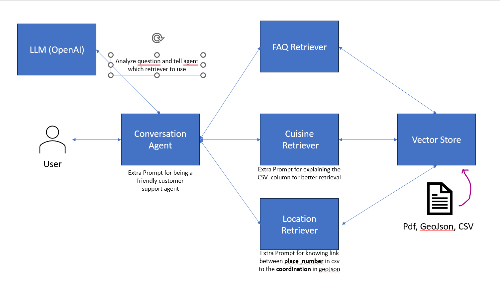

# ZenkoAI-Agent

## 🤖 Project Description

ZenkoAI-Agent is a conversational AI agent designed to act as a friendly customer support assistant for the "Fête des Vendanges" (FDV) festival in Neuchâtel. This intelligent agent is built using Python, the LangChain library, and OpenAI's powerful language models to provide timely and accurate information to festival-goers.

The agent is specialized in answering a wide range of questions related to the festival, categorized into three main areas:

* **FAQ:** For general inquiries about the festival, including its history, event schedules, performers, transportation, and emergency information.
* **Cuisine:** To help users discover the variety of food and beverages available from different vendors at the festival.
* **Location:** To assist users in finding the specific locations of various stalls and attractions within the festival grounds.

---

## 🏗️ Architecture

The ZenkoAI-Agent leverages a modular architecture that ensures efficient and accurate information retrieval. Here's a high-level overview of how it works:



1.  **User Interaction:** The user interacts with the **Conversation Agent**, which serves as the primary interface.
2.  **Intent Recognition:** The agent analyzes the user's query to determine the intent and directs the question to the most appropriate specialized retriever.
3.  **Information Retrieval:** Each retriever—**FAQ, Cuisine, and Location**—is responsible for a specific domain of knowledge. They are connected to a **Vector Store**, which contains indexed information from various data sources, including PDFs, GeoJSON, and CSV files.
4.  **Response Generation:** The retriever fetches the relevant information from the Vector Store, which is then used by the LLM to generate a coherent and user-friendly response.

This architecture allows the agent to handle a diverse range of queries with high accuracy and provide a seamless user experience.

---

## 🛠️ Setup and Installation

Follow these steps to set up and run the ZenkoAI-Agent on your local machine.

### Prerequisites

* **Python 3.7 or higher**
* **Linux or macOS environment** (due to the `jq` package dependency)

### Installation

1.  **Clone the repository:**
    ```bash
    git clone [https://github.com/your-username/ZenkoAI-Agent.git](https://github.com/your-username/ZenkoAI-Agent.git)
    cd ZenkoAI-Agent
    ```

2.  **Install the required packages:**
    ```bash
    pip install -r requirement.txt
    ```

3.  **Set up your OpenAI API Key:**
    You'll need an OpenAI API key to use the language model. Set it as an environment variable in your system:
    ```bash
    export OPENAI_API_KEY="your-openai-api-key"
    ```

---

## 🚀 Usage

To start the agent and begin interacting with it, run the following command in your terminal:

```bash
python agent.py
```

Once the agent is running, it will greet you, and you can start asking questions about the Fête des Vendanges. The agent is designed to be a chatbot, so you can easily integrate it with your front-end interface by replacing the existing loop in `agent.py`.

### Prompt Engineering

For those looking to customize or enhance the agent's performance, you can modify the prompts for the **Cuisine** and **Location** retrievers. Fine-tuning these prompts can lead to more detailed and optimized results for specific types of queries.

Enjoy your experience with the ZenkoAI-Agent! 🎉
